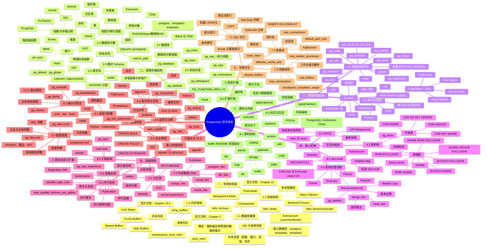

# PostgreSQL学习思维导图（Mermaid）

```mermaid
mindmap
  root((PostgreSQL 知识体系))
    一、宏观架构层
      1.1 数据库集簇
        概念：服务器实例管理的数据库集合
        共享资源：配置、端口、进程、内存
        默认数据库：postgres、template0、template1
        OID 与系统目录
        官方文档：Chapter 2
      1.2 进程架构
        Postmaster
        Backend Process
        Background Writer
        WAL Writer
        Checkpointer
        Autovacuum Launcher/Worker
        Stats Collector
        WAL Archiver
        WAL Receiver/Sender
        多进程模型
        官方文档：Chapter 31
      1.3 内存架构
        共享内存
          Shared Buffers
          WAL Buffers
          CLOG Buffers
          Lock Space
        本地内存
          work_mem
          maintenance_work_mem
          temp_buffers
        官方文档：Chapter 19.4
    二、逻辑存储结构
      2.1 数据库
        数据库对象容器
        postgres、template0、template1
        CREATE DATABASE
        PGDATA/base/数据库OID
        dblink 与 FDW
      2.2 表空间
        pg_default、pg_global
        CREATE TABLESPACE
        SSD/HDD 分层
        物理目录抽象
      2.3 模式 Schema
        命名空间
        public
        search_path
        命名隔离与多租户
      2.4 数据库对象
        表
          堆表
          临时表
          分区表
          外部表
        索引
          B-tree
          Hash
          GiST
          SP-GiST
          GIN
          BRIN
        视图与物化视图
        序列
          nextval
          currval
          setval
        函数与存储过程
          SQL
          PL/pgSQL
          PL/Python
          触发器函数
        其他对象
          触发器
          规则
          FDW
          Extension
      2.5 系统目录
        pg_class
        pg_attribute
        pg_database
        pg_namespace
        pg_tablespace
        pg_type
        pg_index
        pg_stat_* 统计视图
    三、物理存储结构
      3.1 数据目录布局
        base
        global
        pg_wal
        pg_tblspc
        pg_stat 与 pg_stat_tmp
        pg_xact
        pg_multixact
        pg_subtrans
        pg_notify
        pg_serial
        pg_snapshots
        pg_replslot
        配置文件与 PG_VERSION
      3.2 表文件结构
        Page/Block：8KB
          Page Header
          Item ID Array
          Tuple Data
          Free Space
        表 OID 与分段文件
        TOAST
        FSM
        VM
      3.3 WAL
        Write-Ahead Logging
        LSN
        16MB WAL 段
        Checkpoint
        WAL 归档
        PITR
        流复制
    四、核心机制
      4.1 MVCC
        多版本并发控制
        xmin 与 xmax
        事务快照
        XID Wraparound
        可见性规则
      4.2 VACUUM
        标准 VACUUM
        VACUUM FULL
        Autovacuum
        Freeze
        Visibility Map
      4.3 锁机制
        表级锁
          ACCESS SHARE
          ROW SHARE
          ROW EXCLUSIVE
          SHARE UPDATE EXCLUSIVE
          SHARE
          SHARE ROW EXCLUSIVE
          EXCLUSIVE
          ACCESS EXCLUSIVE
        行级锁
          FOR UPDATE
          FOR NO KEY UPDATE
          FOR SHARE
          FOR KEY SHARE
        死锁检测
        pg_locks
      4.4 查询处理流程
        Parser
        Analyzer
        Rewriter
        Planner/Optimizer
          pg_statistic
          成本估算
          Nested Loop
          Hash Join
          Merge Join
          遗传算法
        Executor
        EXPLAIN 与 EXPLAIN ANALYZE
    五、高级特性
      5.1 分区表
        RANGE
        LIST
        HASH
        分区剪枝
        ATTACH/DETACH
        SPLIT/MERGE
      5.2 并行查询
        并行顺序扫描
        并行连接
        并行聚合
        max_parallel_workers_per_gather
        parallel_tuple_cost
      5.3 逻辑复制
        Publication
        Subscription
        Replication Slot
        版本升级
        跨平台复制
        部分表复制
      5.4 外部数据 FDW
        postgres_fdw
        file_fdw
        oracle_fdw
        mysql_fdw
        mongo_fdw
        Pushdown
      5.5 扩展框架
        CREATE EXTENSION
        postgis
        pg_stat_statements
        uuid-ossp
        pg_trgm
        C 语言自定义扩展
    六、运维管理
      6.1 安装与部署
        源码编译
        yum、apt、brew
        Docker、Kubernetes
        initdb
      6.2 配置管理
        postgresql.conf
        pg_hba.conf
        pg_ident.conf
        内存参数
        连接参数
        WAL 参数
        查询规划参数
        日志与复制参数
        SIGHUP、重启、SET
      6.3 备份与恢复
        pg_basebackup
        文件系统快照
        pg_dump
        pg_dumpall
        pg_restore
        PITR
        3-2-1 备份原则
      6.4 高可用与复制
        流复制
          同步
          异步
        级联复制
        pg_ctl promote
        Patroni
        repmgr
        pgpool-II
        PgBouncer
        RTO 与 RPO
      6.5 监控与诊断
        pg_stat_* 
        pg_locks
        pg_activity
        日志分析
        pg_stat_statements
        auto_explain
        Prometheus
        Grafana
        Zabbix
      6.6 安全管理
        CREATE ROLE
        GRANT 与 REVOKE
        行级安全 RLS
        CREATE POLICY
        SSL
        pgaudit
        最小权限原则
    七、性能优化
      7.1 SQL 优化
        EXPLAIN 分析
        B-tree 与覆盖索引
        部分索引
        表达式索引
        查询重写
        COPY
        INSERT ON CONFLICT
        批量 UPDATE
        Seq Scan 判断
      7.2 连接池
        PgBouncer
        会话池
        事务池
        语句池
        max_connections
        default_pool_size
      7.3 参数调优
        shared_buffers
        effective_cache_size
        work_mem
        wal_buffers
        checkpoint_completion_target
        max_connections
        max_worker_processes
        工作负载与硬件
    八、源码与内核
      8.1 源码结构
        backend
        storage
          buffer
          file
          ipc
          lmgr
          page
          smgr
        access
        executor
        optimizer
        parser
        catalog
        utils
        buffer README 阅读起点
      8.2 扩展开发
        C 语言扩展
        PG_FUNCTION_INFO_V1
        自定义数据类型
        操作符
        索引方法
        Hook
      8.3 社区与生态
        pgsql-hackers
        pgsql-general
        PGCon
        PostgreSQL Conference China
        提交补丁
        代码审核
        文档贡献
```
