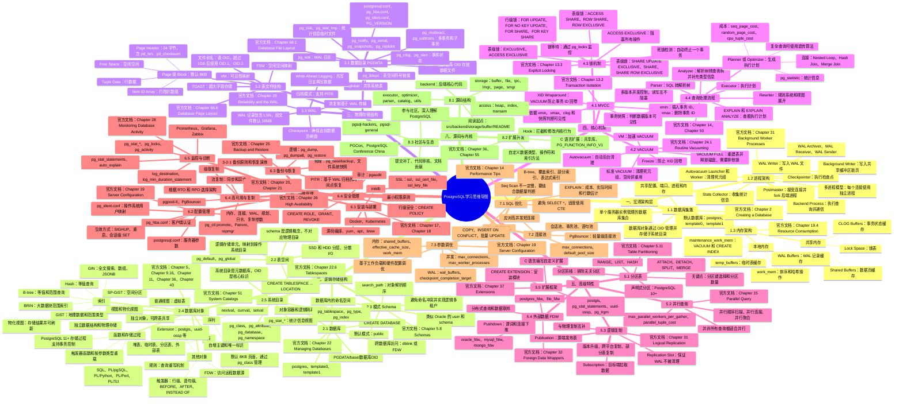

# PostgreSQL学习思维导图

```mermaid
mindmap
	root((PostgreSQL学习思维导图))
		一、宏观架构层
			1.1 数据库集簇
				单个服务器实例管理的数据库集合
				共享配置、端口、进程和内存
				默认数据库：postgres、template0、template1
				数据库对象通过 OID 管理并存储于系统目录
				官方文档：Chapter 2 Creating a Database
			1.2 进程架构
				Postmaster：接受连接并 fork 后端进程
				Backend Process：执行查询并通信
				Background Writer：写入共享缓冲区脏页
				WAL Writer：写入 WAL 文件
				Checkpointer：执行检查点
				Autovacuum Launcher 和 Worker：清理死元组
				Stats Collector：收集统计信息
				WAL Archiver、WAL Receiver、WAL Sender
				多进程模型：每个连接使用独立进程
				官方文档：Chapter 31 Background Worker Processes
			1.3 内存架构
				共享内存
					Shared Buffers：数据页缓存
					WAL Buffers：WAL 记录缓存
					CLOG Buffers：事务状态缓存
					Lock Space：锁表
				本地内存
					work_mem：排序和哈希操作
					maintenance_work_mem：VACUUM 和 CREATE INDEX
					temp_buffers：临时表缓存
				官方文档：Chapter 19.4 Resource Consumption
		二、逻辑存储结构
			2.1 数据库
				对象容器和逻辑隔离边界
				postgres、template0、template1
				CREATE DATABASE
				PGDATA/base/数据库OID
				跨数据库访问：dblink 或 FDW
				官方文档：Chapter 22 Managing Databases
			2.2 表空间
				逻辑存储单元，映射到操作系统目录
				pg_default、pg_global
				CREATE TABLESPACE ... LOCATION
				SSD 和 HDD 分层、分散 I/O
				schema 是逻辑概念，不对应物理目录
				官方文档：Chapter 22.6 Tablespaces
			2.3 模式 Schema
				数据库内的命名空间
				默认模式：public
				search_path：对象解析顺序
				避免命名冲突并实现逻辑多租户
				类似 Oracle 的 user 和 schema
				官方文档：Chapter 5.8 Schemas
			2.4 数据库对象
				表
					堆表、临时表、分区表、外部表
					默认 8KB 页面，通过 pg_class 管理
				索引
					B-tree：等值和范围查询
					Hash：等值查询
					GiST：地理数据和范围类型
					SP-GiST：空间分区
					GIN：全文搜索、数组、JSONB
					BRIN：大数据块范围索引
					独立数据结构和物理存储
				视图和物化视图
					普通视图：虚拟表
					物化视图：存储结果并可刷新
				序列
					自增主键和唯一标识
					nextval、currval、setval
					独立对象，可跨表共享
				函数和存储过程
					SQL、PL/pgSQL、PL/Python、PL/Perl、PL/Tcl
					PostgreSQL 11+ 存储过程支持事务控制
					触发器函数和按参数类型重载
				其他对象
					触发器：行级、语句级、BEFORE、AFTER、INSTEAD OF
					规则：查询重写机制
					FDW：访问远程数据源
					Extension：postgis、uuid-ossp 等
				官方文档：Chapter 5、Chapter 9.16、Chapter 11、Chapter 36、Chapter 43
			2.5 系统目录
				pg_class、pg_attribute、pg_database、pg_namespace
				pg_tablespace、pg_type、pg_index
				pg_stat_*：统计信息视图
				系统目录是元数据库，OID 是核心标识
				官方文档：Chapter 51 System Catalogs
		三、物理存储结构
			3.1 数据目录 PGDATA
				base：按数据库 OID 存放数据文件
				global：共享系统表
				pg_wal：WAL 日志
				pg_tblspc：表空间符号链接
				pg_stat、pg_stat_tmp：统计信息临时文件
				pg_clog、pg_xact：事务状态
				pg_multixact、pg_subtrans：多事务和子事务
				pg_notify、pg_serial、pg_snapshots、pg_replslot
				postgresql.conf、pg_hba.conf、pg_ident.conf、PG_VERSION
				官方文档：Chapter 66.1 Database File Layout
			3.2 表文件结构
				Page 或 Block：默认 8KB
					Page Header：24 字节，含 pd_lsn、pd_checksum
					Item ID Array：行指针数组
					Tuple Data：行数据
					Free Space：空闲空间
				文件命名：表 OID，超过 1GB 后使用 OID.1、OID.2
				TOAST：超大字段存储
				FSM：空闲空间映射
				VM：可见性映射
				官方文档：Chapter 66.6 Database Page Layout
			3.3 WAL
				Write-Ahead Logging：先写日志再写数据
				WAL 记录包含 LSN，段文件默认 16MB
				Checkpoint：确保此前数据页刷盘
				归档模式：支持 PITR
				流复制基于 WAL 传输
				官方文档：Chapter 29 Reliability and the WAL
		四、核心机制
			4.1 MVCC
				多版本并发控制，读写互不阻塞
				xmin：插入事务 ID，xmax：删除事务 ID
				事务快照：判断数据版本可见性
				XID Wraparound：VACUUM 防止事务 ID 回卷
				依据 xmin、xmax、clog 和快照判断可见性
				官方文档：Chapter 13.2 Transaction Isolation
			4.2 VACUUM
				标准 VACUUM：清理死元组，空间供重用
				VACUUM FULL：重建表并释放磁盘，需要排他锁
				Autovacuum：自动后台清理
				Freeze：防止 XID 回卷
				VM：加速 VACUUM
				官方文档：Chapter 24.1 Routine Vacuuming
			4.3 锁机制
				表级锁：ACCESS SHARE、ROW SHARE、ROW EXCLUSIVE
				表级锁：SHARE UPDATE EXCLUSIVE、SHARE、SHARE ROW EXCLUSIVE
				表级锁：EXCLUSIVE、ACCESS EXCLUSIVE
				行级锁：FOR UPDATE、FOR NO KEY UPDATE、FOR SHARE、FOR KEY SHARE
				死锁检测：自动终止一个事务
				锁等待：通过 pg_locks 监控
				ACCESS EXCLUSIVE：阻塞所有操作
				官方文档：Chapter 13.3 Explicit Locking
			4.4 查询处理流程
				Parser：SQL 转解析树
				Analyzer：解析树转查询树并补充类型信息
				Rewriter：规则系统和视图展开
				Planner 或 Optimizer：生成执行计划
					pg_statistic：统计信息
					成本：seq_page_cost、random_page_cost、cpu_tuple_cost
					连接：Nested Loop、Hash Join、Merge Join
					复杂查询可使用遗传算法
				Executor：执行计划
				EXPLAIN 和 EXPLAIN ANALYZE：查看执行计划
				官方文档：Chapter 14、Chapter 50
		五、高级特性
			5.1 分区表
				声明式分区：PostgreSQL 10+
				RANGE、LIST、HASH
				分区剪枝：排除无关分区
				ATTACH、DETACH、SPLIT、MERGE
				关键点：分区键选择和分区数量
				官方文档：Chapter 5.11 Table Partitioning
			5.2 并行查询
				并行顺序扫描、并行连接、并行聚合
				max_parallel_workers_per_gather、parallel_tuple_cost
				并非所有查询都适合并行
				官方文档：Chapter 15 Parallel Query
			5.3 逻辑复制
				Publication：源端发布表
				Subscription：目标端拉取数据
				Replication Slot：保证 WAL 不被清理
				版本升级、跨平台复制、部分表复制
				与物理复制互补
				官方文档：Chapter 31 Logical Replication
			5.4 外部数据 FDW
				postgres_fdw、file_fdw
				oracle_fdw、mysql_fdw、mongo_fdw
				Pushdown：谓词和连接下推
				分布式查询和数据联邦
				官方文档：Chapter 32 Foreign Data Wrappers
			5.5 扩展框架
				CREATE EXTENSION：安装模块
				postgis、pg_stat_statements、uuid-ossp、pg_trgm
				C 语言编写自定义扩展
				官方文档：Chapter 37 Extensions
		六、运维管理
			6.1 安装与部署
				源码编译、yum、apt、brew
				Docker、Kubernetes
				initdb
				官方文档：Chapter 17、Chapter 18
			6.2 配置管理
				postgresql.conf：服务器参数
				pg_hba.conf：客户端认证
				pg_ident.conf：操作系统用户映射
				内存、连接、WAL、规划、日志、复制参数
				生效方式：SIGHUP、重启、会话级 SET
				官方文档：Chapter 19 Server Configuration
			6.3 备份与恢复
				物理：pg_basebackup、文件系统快照
				逻辑：pg_dump、pg_dumpall、pg_restore
				PITR：基于 WAL 归档的时间点恢复
				3-2-1 备份原则和恢复演练
				官方文档：Chapter 25 Backup and Restore
			6.4 高可用与复制
				流复制：同步和异步
				级联复制
				pg_ctl promote、Patroni、repmgr
				pgpool-II、PgBouncer
				根据 RTO 和 RPO 选择架构
				官方文档：Chapter 26 High Availability
			6.5 监控与诊断
				pg_stat_*、pg_locks、pg_activity
				log_destination、log_min_duration_statement
				pg_stat_statements、auto_explain
				Prometheus、Grafana、Zabbix
				官方文档：Chapter 28 Monitoring Database Activity
			6.6 安全管理
				CREATE ROLE、GRANT、REVOKE
				行级安全：CREATE POLICY
				SSL：ssl、ssl_cert_file、ssl_key_file
				审计：pgaudit
				最小权限原则
				官方文档：Chapter 20、Chapter 21
		七、性能优化
			7.1 SQL 优化
				EXPLAIN：成本、实际时间和行数估计
				B-tree、覆盖索引、部分索引、表达式索引
				避免 SELECT *，适度使用 CTE
				COPY、INSERT ON CONFLICT、批量 UPDATE
				Seq Scan 不一定慢，要结合数据量判断
				官方文档：Chapter 14 Performance Tips
			7.2 连接池
				PgBouncer：轻量级连接池
				会话池、事务池、语句池
				max_connections、default_pool_size
				应对高并发短连接
			7.3 参数调优
				内存：shared_buffers、effective_cache_size、work_mem
				WAL：wal_buffers、checkpoint_completion_target
				并发：max_connections、max_worker_processes
				基于工作负载和硬件配置调优
				官方文档：Chapter 19 Server Configuration
		八、源码与内核
			8.1 源码结构
				backend：后端核心代码
				storage：buffer、file、ipc、lmgr、page、smgr
				access：heap、index、transam
				executor、optimizer、parser、catalog、utils
				阅读起点：src/backend/storage/buffer/README
			8.2 扩展开发
				C 语言扩展：共享库、PG_FUNCTION_INFO_V1
				自定义数据类型、操作符和索引方法
				Hook：拦截和修改内核行为
				官方文档：Chapter 36、Chapter 55
			8.3 社区与生态
				pgsql-hackers、pgsql-general
				PGCon、PostgreSQL Conference China
				提交补丁、代码审核、文档贡献
				参与社区，深入理解 PostgreSQL
```
